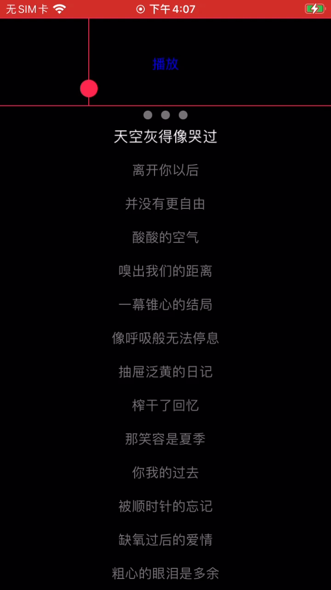

#  KTV歌词解析, 音准评分组件

<br/>

## 介绍

支持XML歌词解析, LRC歌词解析, 解决了多行歌词进度渲染的问题, 评分根据人声实时计算评分




## 使用方法

#### 初始化

```swift
    private lazy var lrcScoreView: AgoraLrcScoreView = {
        let lrcScoreView = AgoraLrcScoreView(delegate: self)
        lrcScoreView.config.scoreConfig.scoreViewHeight = 100
        lrcScoreView.config.scoreConfig.emitterColors = [.systemPink]
        lrcScoreView.config.lrcConfig.lrcFontSize = .systemFont(ofSize: 15)
        return lrcScoreView
    }()
```

<br/>

### 配置属性

#####  组件base配置

```swift
    /// 评分组件配置
    public var scoreConfig: AgoraScoreItemConfigModel = .init()
    /// 歌词组件配置
    public var lrcConfig: AgoraLrcConfigModel = .init()
    /// 是否隐藏评分组件
    public var isHiddenScoreView: Bool = false
    /// 背景图
    public var backgroundImageView: UIImageView?
    /// 评分组件和歌词组件之间的间距 默认: 0
    public var spacing: CGFloat = 0
```

##### 歌词配置

```swift
    /// 无歌词提示文案
    public var tipsString: String = "纯音乐，无歌词"
    /// 提示文字颜色
    public var tipsColor: UIColor = .black
    /// 提示文字大小
    public var tipsFont: UIFont = .systemFont(ofSize: 17)
    /// 分割线的颜色
    public var separatorLineColor: UIColor = .lightGray
    /// 是否隐藏分割线
    public var isHiddenSeparator: Bool = false
    /// 默认歌词背景色
    public var lrcNormalColor: UIColor = .gray
    /// 高亮歌词背景色
    public var lrcHighlightColor: UIColor = .white
    /// 实时绘制的歌词颜色
    public var lrcDrawingColor: UIColor = .orange
    /// 歌词文字大小 默认: 15
    public var lrcFontSize: UIFont = .systemFont(ofSize: 15)
    /// 歌词高亮文字缩放大小 默认: 1.1
    public var lrcHighlightScaleSize: Double = 1.1
    /// 歌词左右两边间距
    public var lrcLeftAndRightMargin: CGFloat = 15
    /// 等待开始圆点背景色 默认: 灰色
    public var waitingViewBgColor: UIColor? = .gray
    /// 等待开始圆点大小 默认: 10
    public var waitingViewSize: CGFloat = 10
    /// 是否可以拖动歌词 默认: true
    public var isDrag: Bool = true
```

##### 评分配置

```swift
    /// 评分视图高度 默认:100
    public var scoreViewHeight: CGFloat = 100
    /// 圆的起始位置: 默认: 100
    public var innerMargin: CGFloat = 100
    /// 线的高度 默认:10
    public var lineHeight: CGFloat = 10
    /// 线的宽度 默认: 120
    public var lineWidht: CGFloat = 120
    /// 默认线的背景色
    public var normalColor: UIColor = .gray
    /// 匹配后线的背景色
    public var highlightColor: UIColor = .orange
    /// 分割线的颜色
    public var separatorLineColor: UIColor = .systemPink
    /// 是否隐藏垂直分割线
    public var isHiddenVerticalSeparatorLine: Bool = false
    /// 是否隐藏上下分割线
    public var isHiddenSeparatorLine: Bool = false
    /// 游标背景色
    public var cursorColor: UIColor = .systemPink
    /// 游标的宽
    public var cursorWidth: CGFloat = 20
    /// 游标的高
    public var cursorHeight: CGFloat = 20
    /// 是否隐藏粒子动画效果
    public var isHiddenEmitterView: Bool = false
    /// 使用图片创建粒子动画
    public var emitterImages: [UIImage]?
    /// emitterImages为空默认使用颜色创建粒子动画
    public var emitterColors: [UIColor] = [.red]
    /// 尾部动画图片
    public var tailAnimateImage: UIImage?
    /// 尾部动画颜色
    public var tailAnimateColor: UIColor? = .yellow
    /// 评分默认分数: 50
    public var defaultScore: Double = 50
```

### 事件回调

##### 歌词Delegate

```swift
weak var delegate: AgoraLrcViewDelegate?
 
protocol AgoraLrcViewDelegate {
    /// 当前播放器的时间 单位: 秒
    func getPlayerCurrentTime() -> TimeInterval
    /// 获取歌曲总时长
    func getTotalTime() -> TimeInterval

    /// 设置播放器时间
    @objc
    optional func seekToTime(time: TimeInterval)
    /// 当前正在播放的歌词和进度
    @objc
    optional func currentPlayerLrc(lrc: String, progress: CGFloat)
}
```

##### 歌词下载Delegate

```swift
weak var downloadDelegate: AgoraLrcDownloadDelegate?

protocol AgoraLrcDownloadDelegate {
    /// 开始下载
    @objc
    optional func beginDownloadLrc(url: String)
    /// 下载完成
    @objc
    optional func downloadLrcFinished(url: String)
    /// 下载进度
    @objc
    optional func downloadLrcProgress(url: String, progress: Double)
    /// 下载失败
    @objc
    optional func downloadLrcError(url: String, error: Error?)
    /// 下载取消
    @objc
    optional func downloadLrcCanceld(url: String)
    /// 开始解析歌词
    @objc
    optional func beginParseLrc()
    /// 解析歌词结束
    @objc
    optional func parseLrcFinished()
}
```

##### 评分Delegate

```swift
weak var scoreDelegate: AgoraKaraokeScoreDelegate?

protocol AgoraKaraokeScoreDelegate {
    /// 分数实时回调
    /// score: 每次增加的分数
    /// cumulativeScore: 累加分数
    /// totalScore: 总分
    @objc optional func agoraKaraokeScore(score: Double, cumulativeScore: Double, totalScore: Double)
}

```

<br/>

### 集成方式

##### 本地pod引入

把 'AgoraLrcScoreView' 复制到根目录, 执行pod

```ruby
pod 'AgoraLrcScore', :path => "AgoraLrcScoreView"
```